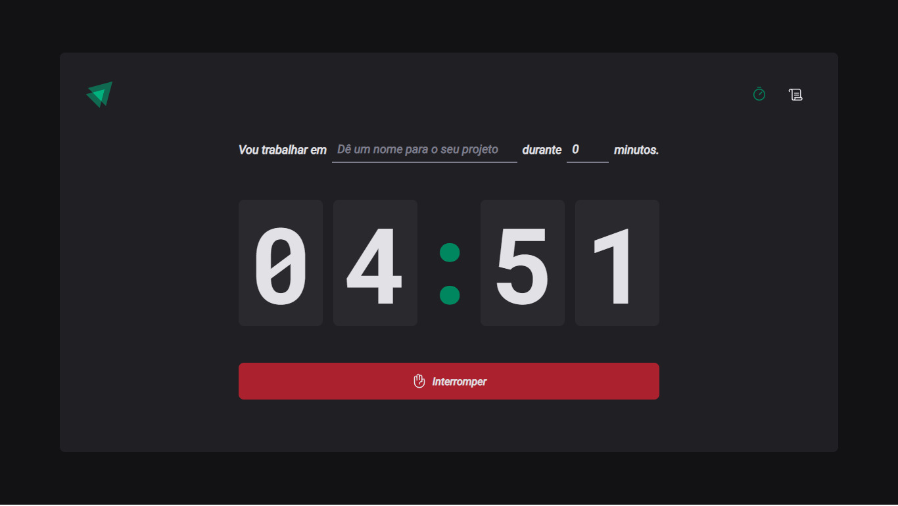
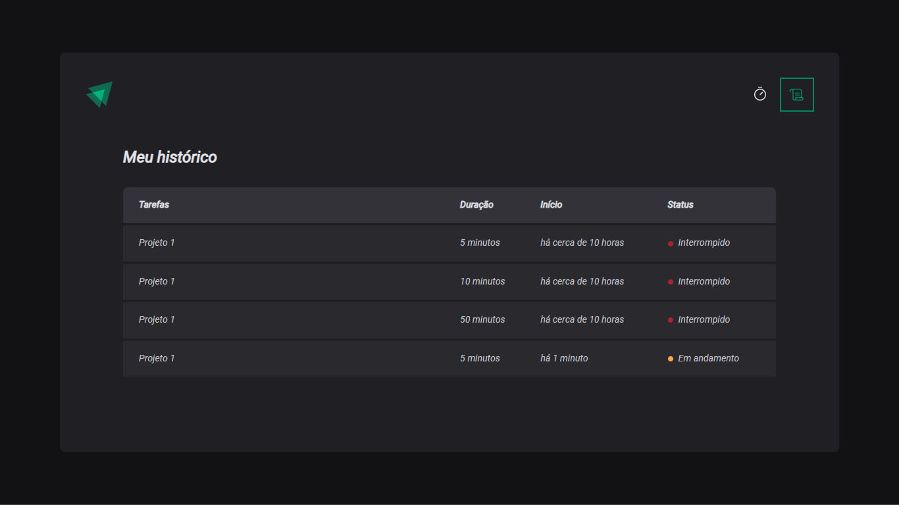

# Project Timer

### 💻 It is an application to use the Pomodoro technique, built while watching video classes on Rocketseat and using localstorage.

### Preview

## Page with Cycle active



## Page with all cycles actives or interrupts



### 🛠️ Technologies 
React with typescript <br/>
Hookform/Resolvers <br/>
Date-fns <br/>
Immer <br/>
Phosphor-react <br/>
React-router-dom <br/>
React-hook-form <br/>
Zod <br/>
Styled-components <br/>

## 🧲 Requirements 
Git<br/>
Node.js <br/>
NPM / YARN

## Installation

```
$ git clone https://github.com/eltonfreitasx/projeto-rocketseat-Timer.git

$ npm i 

$ npm run dev 
```

The application will open in the browser on  http://localhost:5173/

